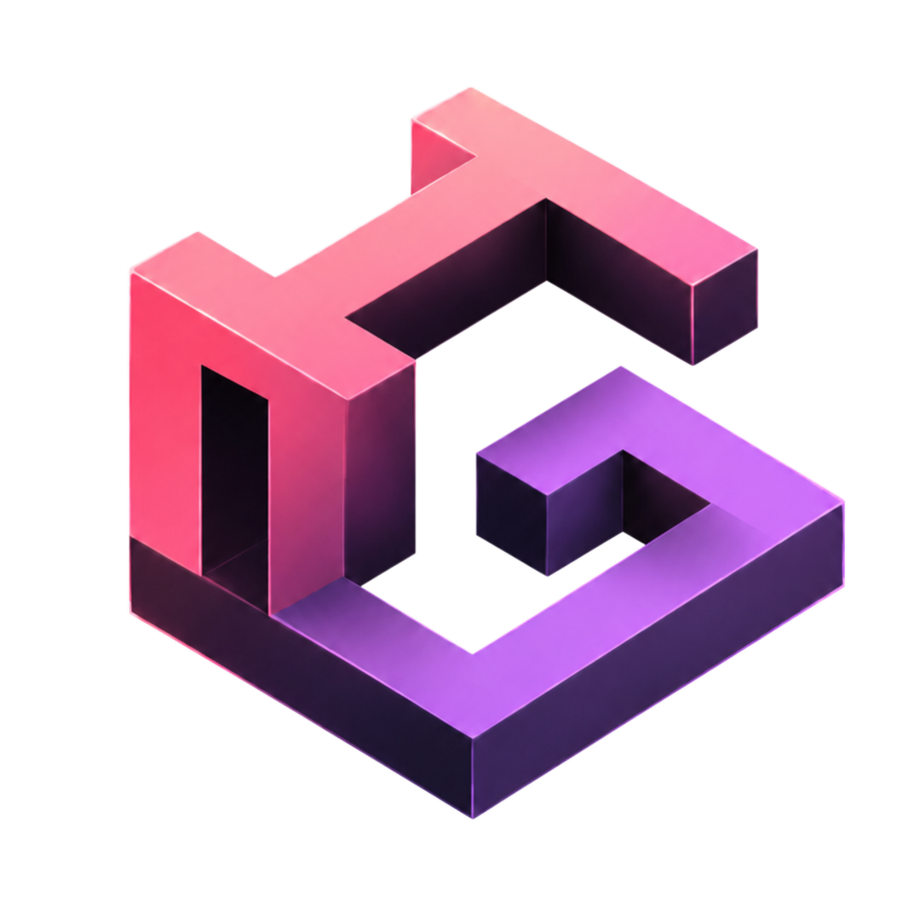

<h1>
  
  <br />
  PortfolioV2
</h1>

<p align="center">
  
  
  
  
  
  
</p>

<p align="center">
  <em>Dark mode (padrão) · Light mode disponível via toggle no header</em>
</p>

<p align="center">
  
  
  
</p>

<p align="center">
  Portfólio pessoal de Hayssa Gomes — Fullstack Developer.<br/>
  Aplicações modernas, responsivas e bem arquitetadas, unindo tecnologia, design e experiência do usuário.
</p>

<h2 >📍 Navegação</h2>

<div >

| Seção | Descrição |
|---|---|
| <a href="#sobre">📌 Sobre</a> | Visão geral do projeto |
| <a href="#roadmap">🗺️ Roadmap</a> | O que já foi feito e próximos passos |
| <a href="#tecnologias">🛠️ Tecnologias</a> | Stack utilizada |
| <a href="#arquitetura">🏗️ Arquitetura</a> | Organização técnica do projeto |
| <a href="#estrutura">📁 Estrutura</a> | Estrutura de pastas |
| <a href="#funcionalidades">✨ Funcionalidades</a> | Principais recursos |
| <a href="#design-system">🎨 Design System</a> | Tokens, cores e padrões visuais |
| <a href="#getting-started">🚀 Getting Started</a> | Como rodar o projeto |
| <a href="#variaveis">⚙️ Variáveis de Ambiente</a> | Configuração do `.env` |
| <a href="#docker">🐳 Docker</a> | Ambiente com containers |
| <a href="#scripts">📜 Scripts</a> | Comandos disponíveis |
| <a href="#deploy">🚀 Deploy</a> | Publicação em produção |
| <a href="#licenca">📄 Licença</a> | Informações de uso |

</div>


<h2 id="sobre">📌 Sobre</h2>

O **PortfolioV2** é um portfólio pessoal desenvolvido para apresentar identidade profissional, habilidades técnicas, projetos e experiência de forma clara, moderna e visualmente marcante.

A proposta do projeto é unir performance, responsividade e uma estética tech refinada, criando uma experiência fluida tanto para quem navega quanto para quem avalia o código por trás da interface.

O projeto foi pensado para:

* Apresentar uma identidade profissional com visual moderno e consistente
* Destacar projetos, habilidades e experiência de forma objetiva e envolvente
* Facilitar deploy em ambientes de produção com Docker e Nginx
* Preservar boas práticas de arquitetura, componentização e organização de código

O visual adota um design system próprio inspirado em terminais, interfaces de código e elementos glassmorphism, com tema **dark** como padrão, suporte a tema **light**, transições suaves e foco em uma experiência elegante e responsiva.

<h2 id="roadmap">🗺️ Roadmap</h2>

### ✅ Implementado

- [x] Estrutura base com React 18 + TypeScript 5
- [x] Build e desenvolvimento com Vite 5
- [x] Estilização com Tailwind CSS 3 e design tokens via CSS variables
- [x] Tema dark como padrão, com toggle para light mode
- [x] Persistência do tema escolhido via `localStorage` sem flash no reload
- [x] Hero Section com headline, badge de status e CTAs
- [x] Console/code card animado com efeito typewriter (hook `useTypewriterCode`)
- [x] Wordmark como componente React (`Wordmark.tsx`)
- [x] Main Brand com tagline no footer (`MainBrand.tsx`)
- [x] Header fixo com navegação suave e destaque de seção ativa (`IntersectionObserver`)
- [x] Footer com ícones de redes sociais
- [x] Seções: Hero, Sobre, Serviços, Projetos, Experiência, Contato
- [x] Modal de projetos com case study detalhado
- [x] Responsividade mobile-first
- [x] Docker multi-stage: desenvolvimento com hot reload, produção com Nginx
- [x] Variáveis de ambiente via `.env`
- [x] Suporte a `prefers-reduced-motion`
- [x] Acessibilidade básica (aria-labels, sr-only, roles semânticos)

### 🔜 Planejado

- [ ] Integração com API própria para gerenciamento de projetos
- [ ] CMS ou painel administrativo
- [ ] Animações avançadas com Framer Motion
- [ ] Testes automatizados (Vitest + Testing Library)
- [ ] CI/CD com GitHub Actions
- [ ] Melhorias de acessibilidade (WCAG AA)
- [ ] Internacionalização PT/EN
- [ ] Página individual por projeto com URL própria
- [ ] Blog com artigos técnicos
- [ ] PWA com suporte offline

<h2 id="tecnologias">🛠️ Tecnologias</h2>

| Tecnologia       | Versão  | Uso                                              |
|------------------|---------|--------------------------------------------------|
| React            | 18.3    | Biblioteca principal de UI                       |
| TypeScript       | 5.5     | Tipagem estática e segurança no desenvolvimento  |
| Vite             | 5.3     | Build tool, HMR e ambiente de desenvolvimento    |
| Tailwind CSS     | 3.4     | Estilização utilitária com tokens via CSS vars   |
| PostCSS          | 8.4     | Processamento de CSS                             |
| Autoprefixer     | 10.4    | Compatibilidade cross-browser automatizada       |
| Docker           | 20+     | Padronização de ambiente dev e produção          |
| Nginx (alpine)   | latest  | Servidor de arquivos estáticos em produção       |
| Node.js          | 20 LTS  | Runtime para desenvolvimento e build             |

**Fontes utilizadas (via Google Fonts):**

| Família          | Uso                          |
|------------------|------------------------------|
| Space Grotesk    | Títulos e headlines          |
| Plus Jakarta Sans| Textos e parágrafos          |
| Inter            | Labels, badges e UI compacta |
| Sansation        | Wordmark / identidade visual |

<h2 id="arquitetura">🏗️ Arquitetura</h2>

O projeto segue uma arquitetura modular e componentizada, organizada em camadas com responsabilidades bem definidas:

```
Pages / Sections
      │
      ▼
Components (Layout, Brand, UI)
      │
      ▼
Hooks (useTheme, useActiveSection, useTypewriterCode)
      │
      ▼
Data (projetos, serviços, stack, navegação)
      │
      ▼
Styles / Design System (theme.css + globals.css)
```

**Princípios aplicados:**

- **Separação de responsabilidades** — seções, componentes, hooks e dados em camadas independentes
- **Componentização** — cada elemento visual é um componente reutilizável e isolado
- **Design Tokens** — cores definidas como variáveis CSS no formato RGB (`rgb(var(--c-primary) / <alpha>)`) para suporte completo aos modificadores de opacidade do Tailwind
- **Hook pattern** — lógica de estado e efeitos encapsulada em hooks customizados
- **Imutabilidade de dados** — arrays e objetos de configuração definidos fora dos componentes
- **Baixo acoplamento** — componentes não dependem de estado global ou contexto externo

<h2 id="estrutura">📁 Estrutura de Pastas</h2>

```txt
portfolio-v2/
├── public/                     # Arquivos públicos e estáticos servidos diretamente pelo navegador
│
├── src/
│   ├── app/                    # Ponto de entrada da aplicação, providers e configuração global
│   │
│   ├── components/             # Componentes reutilizáveis da interface
│   │   ├── brand/              # Componentes de identidade visual, logo, wordmark e marca principal
│   │   ├── layout/             # Componentes estruturais como Header, Footer, Container e navegação
│   │   └── ui/                 # Componentes base e reutilizáveis como botões, cards, badges e headings
│   │
│   ├── config/                 # Configurações da aplicação, variáveis de ambiente e constantes globais
│   │
│   ├── data/                   # Dados estáticos utilizados nas seções, como projetos, stacks e links
│   │
│   ├── hooks/                  # Hooks customizados para lógica reutilizável e comportamentos da interface
│   │
│   ├── sections/               # Seções principais da landing page, como Hero, About, Projects e Contact
│   │
│   ├── styles/                 # Estilos globais e tokens visuais da aplicação
│   │   ├── theme.css           # Tokens de cor para dark e light mode
│   │   └── globals.css         # Estilos base, utilitários globais e animações
│   │
│   ├── types/                  # Tipos TypeScript compartilhados entre componentes, dados e configurações
│   │
│   ├── main.tsx                # Arquivo responsável por renderizar a aplicação no DOM
│   └── vite-env.d.ts           # Tipagens globais do Vite
│
├── .env                        # Variáveis de ambiente utilizadas pela aplicação
├── .env.example                # Exemplo de variáveis necessárias para configurar o projeto
├── Dockerfile                  # Build multi-stage para desenvolvimento, build e produção
├── docker-compose.yml          # Orquestração dos containers em ambiente de desenvolvimento
├── nginx.conf                  # Configuração do Nginx para servir a aplicação em produção
├── tailwind.config.ts          # Configuração do Tailwind CSS, tema, tokens e breakpoints
├── vite.config.ts              # Configuração do Vite
├── tsconfig.json               # Configuração principal do TypeScript
├── package.json                # Dependências, scripts e metadados do projeto
└── README.md                   # Documentação principal do projeto
```


<h2 id="funcionalidades">✨ Funcionalidades</h2>

### 🦸 Hero Section

- Headline principal com efeito glitch no hover
- Badge de status animado `SYSTEM.INITIALIZE(DEV_PORTFOLIO)`
- Parágrafo de apresentação
- Botões CTA para projetos e contato com animações de hover
- **Console animado** (`CodeConsole`) com typewriter effect, syntax highlighting, pausas humanas e loop — inicia preenchido e redigita em ciclo
- Barra de tecnologias com grayscale que colore no hover
- Efeito glassmorphism no card do console

### 🎨 Identidade visual

- `Wordmark.tsx` — logo compacto no header
- `MainBrand.tsx` — logo completo com tagline no footer
- Gradiente de marca em `brand-name` e `brand-surname` via CSS custom properties
- Dark mode como padrão, light mode alternativo com transição suave

### 🧭 Navegação

- Header fixo com `backdrop-blur` e fundo semi-transparente
- Seção ativa destacada via `IntersectionObserver` (`useActiveSection`)
- Scroll suave para seções
- Menu mobile com hambúrguer
- Toggle de tema (ícone Material Symbols)

### 📂 Projetos

- Cards com thumbnail, stack de tecnologias e links
- Modal com case study completo (problema, solução, desafios, resultados)
- Layout responsivo em grid

### 📬 Contato

- Links para redes sociais (Instagram, LinkedIn, GitHub, X, YouTube, TikTok)
- Formulário de contato
- Footer com copyright e ícones SVG inline

### 🌓 Tema dark/light

- Dark como padrão
- Persiste em `localStorage`
- Inline script no `index.html` previne flash (FOUC)
- Transição suave com classe `.theme-transitioning`
- Todos os tokens de cor respondem automaticamente

<h2 id="design-system">🎨 Design System</h2>

### Paleta de cores

Todas as cores são definidas como variáveis CSS no formato RGB, compatíveis com os modificadores de opacidade do Tailwind (`bg-primary/10`, `text-on-surface/60`).

| Token              | Dark Mode (RGB)   | Light Mode (RGB)  | Descrição                        |
|--------------------|-------------------|-------------------|----------------------------------|
| `primary`          | `199 0 56`        | `199 0 56`        | Vermelho/crimson — cor principal |
| `primary-container`| `255 81 103`      | `255 81 103`      | Tom mais vibrante do primário    |
| `secondary`        | `0 219 233`       | `0 106 112`       | Ciano/teal — destaque técnico    |
| `tertiary`         | `195 101 255`     | `112 0 168`       | Roxo — detalhes e keywords       |
| `surface`          | `19 19 19`        | `250 247 247`     | Fundo principal                  |
| `surface-container`| `28 28 28`        | `237 230 230`     | Cards e superfícies elevadas     |
| `on-surface`       | `236 224 224`     | `26 21 22`        | Texto sobre fundo                |
| `outline-variant`  | `80 56 56`        | `212 192 192`     | Bordas sutis                     |

### Tipografia

| Papel       | Família           | Uso                                      |
|-------------|-------------------|------------------------------------------|
| `headline`  | Space Grotesk     | Títulos, h1–h3, números de destaque      |
| `body`      | Plus Jakarta Sans | Parágrafos e textos corridos             |
| `label`     | Inter             | Labels, badges, botões, navegação        |
| `brand`     | Sansation         | Wordmark (HAYSSA / GOMES)                |
| `mono`      | Monospace sistema | Code console, snippets de código         |

### Padrões visuais

- **Glassmorphism** — `backdrop-blur` + `bg-white/35 dark:bg-black/35` + bordas sutis
- **Cyber grid** — grade de fundo via `background-image` com CSS vars
- **Glow effects** — `text-shadow` e `box-shadow` com cor primária
- **Sombras soft** — `shadow-2xl shadow-black/60`
- **Efeito glitch** — duplicação de sombra de texto no hover
- **Scanlines** — overlay CRT na imagem de perfil
- **Animações** — `animate-pulse`, `animate-ping`, `cursor-blink` personalizado
- **Bordas** — raio mínimo por padrão (0.125rem), crescendo até `xl` (0.5rem)

<h2 id="getting-started">🚀 Getting Started</h2>

### Pré-requisitos

- Node.js `>=20`
- npm `>=10`

### Instalação

```bash
# Clone o repositório
git clone https://github.com/issagomesdev/portfolio-v2
cd portfolio-v2

# Instale as dependências
npm install

# Copie o arquivo de variáveis de ambiente
cp .env.example .env
```

### Desenvolvimento

```bash
npm run dev
```

Acesse em: **http://localhost:3000**

> A porta pode ser alterada via variável `PORT` no `.env`.


<h2 id="variaveis">⚙️ Variáveis de Ambiente</h2>

Crie um arquivo `.env` na raiz do projeto:

```env
# Porta do servidor de desenvolvimento
PORT=3000

# URL da API (para integrações futuras)
VITE_API_URL=http://localhost:3333
```

| Variável        | Padrão                    | Descrição                                  |
|-----------------|---------------------------|--------------------------------------------|
| `PORT`          | `3000`                    | Porta do servidor Vite e Docker            |
| `VITE_API_URL`  | `http://localhost:3333`   | URL base da API para requisições frontend  |

> Variáveis com prefixo `VITE_` são expostas ao cliente via `import.meta.env`.

<h2 id="docker">🐳 Docker</h2>

O projeto possui um `Dockerfile` multi-stage com três targets: `development`, `builder` e `production`.

### Desenvolvimento (com hot reload)

```bash
docker compose up --build
```

- Usa `node:20-alpine`
- Monta o diretório local como volume para hot reload
- Hot reload com polling habilitado (`usePolling: true`) para compatibilidade com Windows/macOS
- Porta configurável via `PORT` no `.env` (padrão: `3000`)

### Produção (Nginx)

```bash
# Build e execução da imagem de produção
docker build --target production -t portfolio-v2 .
docker run -p 80:80 portfolio-v2
```

- Stage `builder`: compila o projeto com `npm ci && npm run build`
- Stage `production`: copia o `/dist` para `nginx:alpine`
- Servido via Nginx na porta `80`
- Configuração personalizada em `nginx.conf`

### Estrutura do Dockerfile

```
development  →  node:20-alpine  →  npm run dev (hot reload)
builder      →  node:20-alpine  →  npm run build
production   →  nginx:alpine    →  serve /dist
```

<h2 id="scripts">📜 Scripts Disponíveis</h2>

| Script                | Descrição                                       |
|-----------------------|-------------------------------------------------|
| `npm run dev`         | Inicia o servidor de desenvolvimento (Vite HMR)|
| `npm run build`       | Type-check + build de produção em `/dist`       |
| `npm run preview`     | Pré-visualiza o build de produção localmente    |
| `npm run type-check`  | Valida tipagem TypeScript sem gerar arquivos    |

---

<h2 id="deploy">🚀 Deploy</h2>

### VPS com Docker + Nginx

1. **Acesse o servidor e clone o repositório:**

```bash
git clone https://github.com/issagomesdev/portfolio-v2
cd portfolio-v2
```

2. **Configure as variáveis de ambiente:**

```bash
cp .env.example .env
nano .env
```

3. **Gere e suba o container de produção:**

```bash
docker build --target production -t portfolio-v2 .
docker run -d --name portfolio -p 80:80 --restart unless-stopped portfolio-v2
```

4. **Configure o domínio e reverse proxy (Nginx externo ou Caddy):**

```nginx
server {
    listen 80;
    server_name url.exemple www.url.exemple;

    location / {
        proxy_pass http://localhost:80;
    }
}
```

5. **Configure SSL com Certbot:**

```bash
certbot --nginx -d url.exemple -d www.url.exemple
```

> O projeto pode ser acessado em: **https://url.exemple** *(substituir pelo domínio real)*

<h2 id="praticas">✅ Boas Práticas Aplicadas</h2>

- **Mobile-first** — estilos base para mobile, breakpoints para telas maiores
- **Componentização** — UI dividida em componentes reutilizáveis e isolados
- **Tipagem estrita** — TypeScript com `strict: true` e `noEmit` validado no build
- **Design Tokens** — paleta centralizada em variáveis CSS, sem hardcode de cores
- **Separação de responsabilidades** — dados, lógica e apresentação em camadas distintas
- **Hooks customizados** — lógica de efeitos encapsulada e testável independentemente
- **Ambiente padronizado** — Docker garante paridade dev/prod em qualquer máquina
- **Sem flash de tema** — script inline no `<head>` aplica o tema antes da renderização
- **Acessibilidade** — `aria-label`, `sr-only`, `aria-hidden`, roles semânticos, `prefers-reduced-motion`
- **Performance** — imagens otimizadas, fontes carregadas via `<link preconnect>`, lazy render
- **Semântica HTML** — `<header>`, `<main>`, `<section>`, `<aside>`, `<footer>`, `<nav>`
- **Código limpo** — sem comentários desnecessários, nomes autodescritivos, sem lógica duplicada


<h2 id="relacionados">🔗 Projetos Relacionados</h2>

| Projeto | Descrição | Repositório |
|---|---|---|
| **Portfolio** | Versão anterior do portfólio pessoal, desenvolvida como base inicial da identidade visual, apresentação profissional e estrutura de seções. | [Acessar repositório](https://github.com/issagomesdev/portfolio) |
| **Portfolio API** | API criada para servir dados do portfólio, como projetos, tecnologias, informações profissionais e conteúdos dinâmicos para futuras integrações. | [Acessar repositório](https://github.com/issagomesdev/portfolio-api) |

<h2 id="licenca">📄 Licença</h2>

Projeto desenvolvido para fins de portfólio, demonstração técnica e evolução profissional.

---
<p align="center">
  Feito com foco em performance, usabilidade e código bem estruturado.<br/>
  <strong>Hayssa Gomes</strong> · Fullstack Developer
  <br/> 
  <a href="https://instagram.com/issagomesdev">Instagram</a> •
  <a href="https://linkedin.com/in/issagomesdev">LinkedIn</a> •
  <a href="https://github.com/issagomesdev">GitHub</a>
</p>
